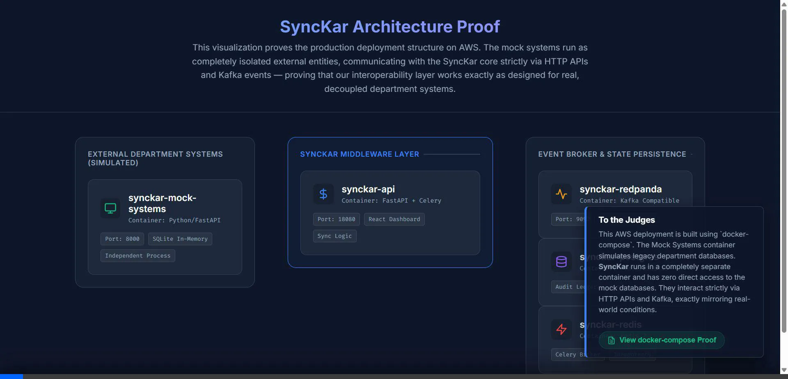
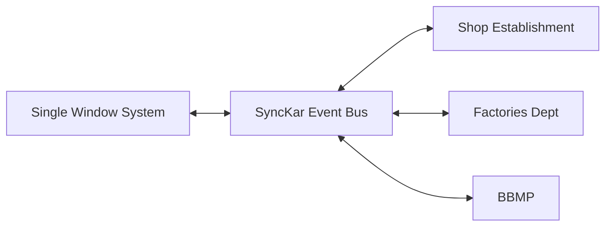

<div align="center">
  
# ⚡ SyncKar — Interoperability Layer

**A non-invasive, event-driven data synchronisation layer for Karnataka's Digital Ecosystem.**



</div>

## 📌 The Problem

Karnataka's Single Window System (SWS) handles new business registrations, while 40+ legacy department systems (Factories, Shop & Establishment, etc.) continue to accept service requests independently. This creates a severe **split-brain problem**:
- Identical business data is updated in multiple disconnected systems simultaneously.
- Results in conflicting records, silent data loss, and regulatory compliance gaps.

## 💡 The Solution

**SyncKar** sits as an intelligent middleware between SWS and legacy department systems, orchestrating bidirectional data flows without requiring massive architectural rewrites on either end.



### ✨ Key Features
- **Bidirectional Sync:** Changes flow seamlessly from SWS ↔ Departments via a KRaft Kafka event bus.
- **Smart Conflict Resolution:** Deterministic Policy Matrix (e.g., `SWS_WINS`, `LWW`) automatically resolves simultaneous edits without human intervention.
- **BSA 2023 Compliant Audit Ledger:** Every single data propagation is RSA-signed, SHA-256 hashed, and stored in an immutable, append-only PostgreSQL ledger.
- **Idempotent Operations:** Redis-backed Two-Phase Reservation guarantees zero duplicate writes, even if Kafka redelivers messages.
- **Zero-Data-Loss (DLQ):** Messages that fail multiple delivery attempts are captured in a Dead Letter Queue for Data Steward review and manual retry.

---

## 🛠️ Technology Stack

| Component | Technology | Purpose |
| :--- | :--- | :--- |
| **Runtime** | Python 3.11+, FastAPI | Core API and Celery orchestration |
| **Event Bus** | Redpanda (Kafka) | High-throughput, partitioned event streaming |
| **Database** | PostgreSQL 16 | Transactional Outbox and Immutable Audit Ledger |
| **Cache & State** | Redis 7 | Idempotency locks, Circuit Breakers, Poller Watermarks |
| **Dashboard** | React 18, Vite | Real-time monitoring, DLQ management, Conflict visualizer |

---

## 🚀 Local Development Guide (Windows & Linux)

SyncKar's event-driven architecture relies heavily on complex, interconnected infrastructure. Because installing Redpanda, Redis, and Postgres natively is difficult and prone to errors, **the official and supported way to run SyncKar locally is via Docker Compose**.

### Step 1: Install Prerequisites
- **Windows / Mac**: Install [Docker Desktop](https://docs.docker.com/desktop/) and ensure the Docker Engine is running (green icon in the system tray).
- **Linux**: Install Docker Engine and the Compose plugin:
  ```bash
  sudo apt-get update
  sudo apt-get install docker-ce docker-ce-cli containerd.io docker-compose-plugin
  ```

### Step 2: Spin up the Architecture
Open your terminal (PowerShell or Bash), navigate to the project directory, and run:

```bash
# 1. Copy the environment template
cp .env.example .env     # (On Windows PowerShell use: Copy-Item .env.example .env)

# 2. Generate RSA keys required for the BSA-compliant Audit Ledger
python scripts/generate_rsa_keys.py

# 3. Build and start the entire 5-container stack in detached mode
docker compose up --build -d
```
*Note: The initial build may take 3-5 minutes as it pulls the database and streaming images.*

### Step 3: Seed the Database
Populate the database with mock Karnataka businesses:
```bash
docker compose exec synckar-api python scripts/run_migrations.py
docker compose exec synckar-api python scripts/seed_data.py
```

### Step 4: Access the System (Two Options)

#### Option A: Standard Viewing (No hot-reload)
The `docker compose` command automatically builds the React dashboard and serves it statically from the Python backend. View it immediately at:
👉 **http://localhost:18080/dashboard**

#### Option B: Active UI Development (With React Hot-Reload)
To edit the React UI (`dashboard/src/App.jsx`) and see instant updates:

1. Ensure the Docker backend is running (`docker compose up -d`).
2. Open a new terminal and navigate to the `dashboard` directory:
   ```bash
   cd dashboard
   ```
3. Create a `.env.local` file to point Vite to the local Docker API:
   ```bash
   echo "VITE_API_URL=http://localhost:18080" > .env.local
   # (On Windows PowerShell use: "VITE_API_URL=http://localhost:18080" | Out-File -Encoding ASCII .env.local)
   ```
4. Start the Vite dev server:
   ```bash
   npm install
   npm run dev
   ```
5. Open the provided localhost URL (usually **http://localhost:5173**).

---

## 🌩️ AWS EC2 Deployment

SyncKar is designed to run its entire stack on a **single EC2 t3.small instance**.

### Deploy in 3 Steps
1. **Ensure Port 18080 is open** in your EC2 Security Group.
2. **SSH into your instance**:
   ```bash
   ssh -i hackathon_key.pem ubuntu@<EC2_PUBLIC_IP>
   ```
3. **Run the One-Shot Setup Script**:
   ```bash
   # Upload the script from your local machine
   scp -i hackathon_key.pem setup.sh ubuntu@<EC2_PUBLIC_IP>:~/setup.sh
   
   # Run it on the EC2 instance
   bash ~/setup.sh
   ```
The script will clone the repo, configure Docker Compose, wait for health checks, migrate the DB, and seed demo data automatically.

---

## 🧪 Interactive Demo Scenarios

Once running locally or on EC2, you can simulate real-world data flows using the bundled demo scripts.

**Scenario A: Normal Propagation**
*Changes originating in SWS automatically propagate down to Department Systems.*
```bash
docker compose exec synckar-api python scripts/demo_scenario_a.py
```

**Scenario B: Reverse Propagation**
*Changes originating in a Department System automatically propagate up to SWS.*
```bash
docker compose exec synckar-api python scripts/demo_scenario_b.py
```

**Scenario C: Conflict Resolution ⚡**
*Simulates two users updating the exact same business field at the exact same millisecond in two different portals. Watch SyncKar intercept the collision, apply a deterministic policy, and maintain database integrity.*
```bash
docker compose exec synckar-api python scripts/demo_scenario_c.py
```

*(Reset the system at any time with `python scripts/reset_state.py` followed by `python scripts/seed_data.py`)*

---
<div align="center">
<i>Built for Karnataka Commerce & Industries</i>
</div>
